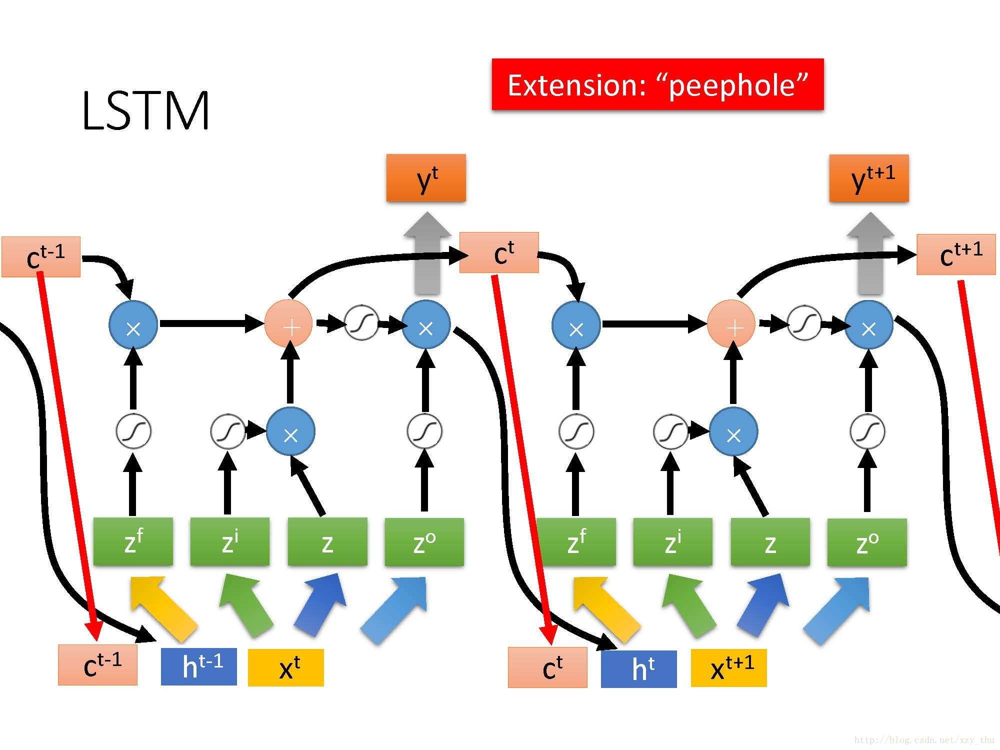

### RNN和LSTM模型的数学层面

参考文献：
[Understanding LSTM Networks]
[为什么相比于RNN，LSTM在梯度消失上表现更好?]
[RNN以及LSTM的介绍和公式梳理]

[Understanding LSTM Networks]: http://colah.github.io/posts/2015-08-Understanding-LSTMs/

[为什么相比于RNN，LSTM在梯度消失上表现更好?]: https://www.zhihu.com/question/44895610/answer/616818627

[RNN以及LSTM的介绍和公式梳理]: https://blog.csdn.net/dark_scope/article/details/47056361

#### 从RNN说起

先来看看RNN的前向传播：

再看看前向传播公式：

公式(1)中 是隐藏层的激活函数，一般为Sigmoid function，输入是一个序列  , 输出就是迭代的计算  和 。

#### RNN面临的问题
RNN主要面临的是在处理长序列的问题时，梯度消失的问题。[Understanding LSTM Networks]中的对问题的描述如下：
>But there are also cases where we need more context. Consider trying to predict the last word in the text “I grew up in France… I speak fluent French.” Recent information suggests that the next word is probably the name of a language, but if we want to narrow down which language, we need the context of France, from further back. It’s entirely possible for the gap between the relevant information and the point where it is needed to become very large.Unfortunately, as that gap grows, RNNs become unable to learn to connect the information.

当上下文相关信息在time step上的距离越来越远时，RNN就很难利用到前面的上下文信息了。

这个问题主要原因在于公式（1）这一项：

我们可以想象 $h_{t-1}$ 里其实是包含 $h_{0}$ 到 $h_{t-2}$ 这些项的，所以我们在进行反向传播时，在求 $W_{hh}$ 的梯度时根据链式法则会遇到一个很长的 $h_{t}$ 的梯度的导数 $h_{t}^{'}$ 的连乘。就像下面这样：

从(1)中我们可得：

而其中sigmoid的导数为：

所以 $\sigma ^{'}$ 的大小在0到0.25之间，可以想象这样一个因子在梯度计算中被重复相乘梯度会越来越小，导致两个在time step距离较远的输入无法产生足够的影响。

#### 再看看LSTM
LSTM前向传播的图示如下：

LSTM的前向传播公式如下：

需要注意几点细节：
  * 首先input gate和foget gate不仅由当前时间点的输入 控制，还受到上个时间点记忆 和上个时间点的输出 共同控制（看第一行和第二行）。
  * 影响当前即已更新的输入是当前时间点输入 和上一个时间点的输出。
  * 控制output gate与其他两个gate不同的是输入中不包含上个时间点记忆 取而代之的是当前更新过的记忆 。

#### LSTM是怎么解决RNN的问题的呢？
LSTM缓解了梯度消失的问题，那么他是如何做到的呢？RNN中的主要问题出在$h_{t}$ 再做反向传播时梯度串联的相乘，越来越小的问题上，导致较早期的记忆无法对较远的判断造成影响。而在LSTM模型中，我们看看记忆这一项是怎么传播的:

这里再反向传播时：

而：

 是一个sigmoid函数，它上限为1下线为0，也就是说模型只需要决定门的开关就行了，主要收到深度影响的其实是对门限的更新能力，所以相比于RNN来说，LSTM能够更好的传递上下文的信息。

#### 总结
