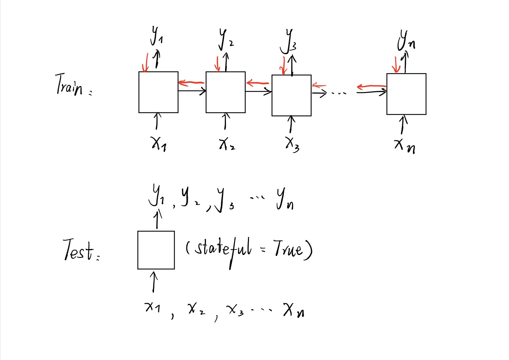

### LSTM中的stateful
#### stateful LSTM的训练
官方文档解释：

>stateful: Boolean (default False). If True, the last state for each sample at index i in a batch will be used as initial state for the sample of index i in the following batch.

当stateful=True意味着在训练时每个batch的状态(state)都会传递到下一个batch的训练中，作为下一个batch训练的初始状态(initial_state)。而stateful=False时，每训练完一个batch网络中的状态都会被重置。

所以这里的一个关键问题在于initial_state，在keras的LSTM中，如果不特别定义一个LSTM的initial_state就是0，但是也有人提出initial_state也可以作为一个参数，因为它不是计算出来的，而是直接给出的，所以其实完全可以把它设置成一个可以训练的参数，作为一种用来相加的权重。所以stateful所作的就是把前一个batch的state作为下个batch训练时的initial_state，所以在训练时只有确定有这种需要时才需要打开stateful。

#### 通过一个实例应用解释
在设计一个用于实时通话的编解码器的后置滤波器的时候，我打算训练一个LSTM模型作为后置滤波器，由于系统是实时的，所以需要每一帧语音到达时都有一个输出，而且还能利用到前文的信息，于是模型的训练和测试过程如下：

* 训练阶段：输入为一个很长的序列，例如300 time step，模型设置为stateless，每次训练一batch，所以模型可以在这个很长的序列上进行正向和反向传播。
* 测试阶段：在模型训练完成后，重新载入模型时需要打开stateful，并将input的步长设为1，这样以来每一个frame到来时我们就可以将其输入模型处理，由于开启了stateful，前一帧语音处理完后的memory会保存在cell中，作为下一个frame进来时的初始状态，这样就如同训练阶段的前向传播一样进行预测了。（注意每测试一段语音需要调用model.reset_states()来重置状态）。
