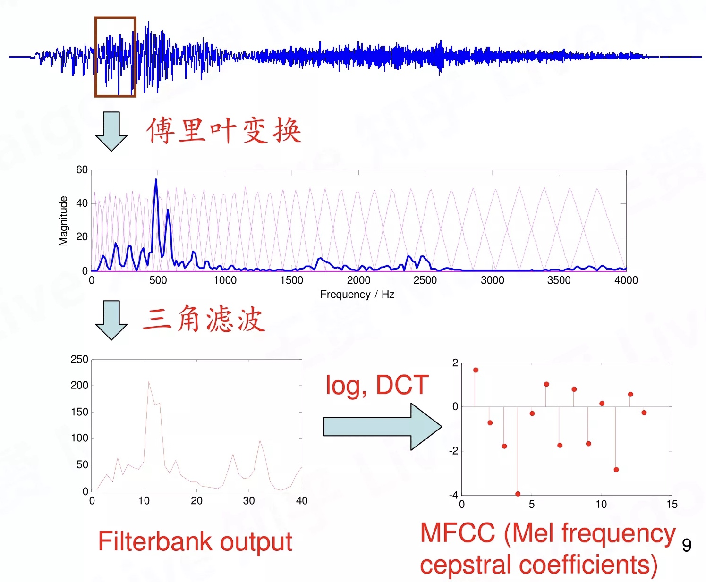
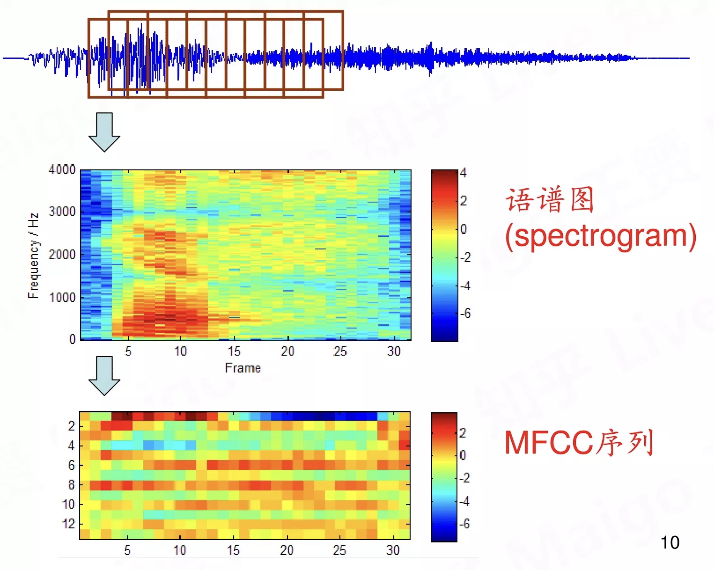

## 语音识别技术基础
参考文献：

### 孤立词识别

#### 特征提取

特征提的目的是将波形转换成更适合比较的信息，一般所提取的特征是MFCC(Mel frequency cepstral coefficients)，操作步骤如下：
1. 需要将语音信号分帧处理，一帧信号的时长通常是20ms到50ms，这是因为需要一帧信号包含2到3个周期。取帧时需要有重叠，目的时不漏掉帧与帧之间的重要信息。
2. 然后对一帧信号做傅里叶变换获得频谱，再使用三角滤波将频率轴转换到Mel频率，目的是去掉频谱中的精细结构，因为精细结构是与音高有关的，而且强调低频弱化高频，这是与人耳对声音的感受有关的。
3. 将强度轴转换到log域，并做DCT变换（离散余弦变换），使用DCT的目的是进一步压缩信息。

转换过程的图示如下：

转换的结果示例如下：

使用MFCC的优点是排除基频信息，符合听觉习惯，参数维度低，而缺点是视野小，受滤波，噪声，回声的影响严重。

#### GMM高斯混合模型

#### HMM隐马尔可夫链模型

#### 语音识别的基本方程

 是识别结果， 是任意一个单词， 是待识别的语音信号， 代表声学模型，它表示了在给定这个单词的情况下，发出这个声音的概率是多少， 表示单词的先验概率，也就是语言模型。

### 连续语音识别

### 神经网络对语音识别的应用
